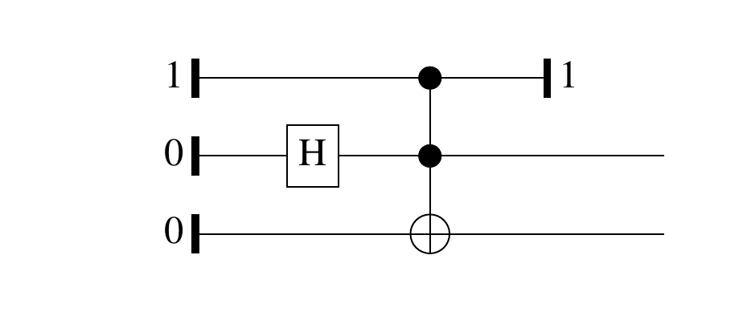
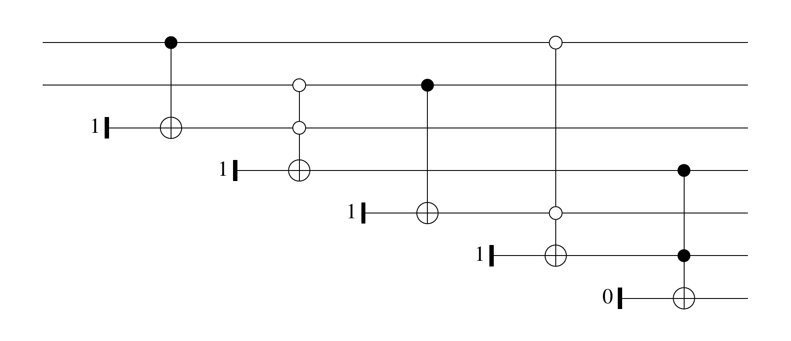

# Quipper

## Instalación

<div style="font-size:1.2em">
[`mx-psi.github.io/quantum-algorithms`](https://mx-psi.github.io/quantum-algorithms)
</div>

. . .

1. Instalar [`stack`](https://docs.haskellstack.org/en/stable/README/),
2. clonar [`mx-psi/quantum-algorithms`](https://github.com/mx-psi/quantum-algorithms) y 
3. ejecutar `make build`


## El lenguaje

Quipper es un lenguaje embebido en Haskell que permite definir circuitos.
Nos permite:

- Dar instrucciones para generar un circuito,
- generar los circuitos y
- ejecutarlos.

Todas las operaciones ocurren en una mónada `Circ`.

## Un ejemplo de circuito

::::{.twocol}
:::{}
```haskell
bellPair :: Circ (Qubit, Qubit)
bellPair = do
  (x, y, z) <- qinit (True, False, False)
  y <- hadamard y
  (x,y,z) <- toffoli (x, y, z)
  qterm True x
  pure (y, z)
```
:::
:::{}

:::
::::


# Circuitos clásicos

## El espacio de estados

Un ordenador clásico hace cálculos con símbolos.

:::{.example}
Un **bit** es un elemento del espacio de estados $\mathbb{B} := \{0,1\}$.
:::

En Quipper el tipo de los bits es `Bit`.

<aside class="notes">
- Explicar $\mathbb{B}^n$.
- Podemos trabajar con más de dos símbolos
- Codificamos los problemas de la forma usual
</aside>

## Puertas clásicas

:::{.definition}
Una **puerta clásica** es una función $f: \mathbb{B}^n \to \mathbb{B}^m$.

- $n$ es el número de **entradas** y
- $m$ es el número de **salidas**.
:::

. . .


```haskell
cgate_and :: [Bit] -> Circ Bit
cgate_not :: Bit -> Circ Bit
cinit :: Bool -> Circ Bit
cdiscard :: Bit -> Circ ()
```


<aside class="notes">
- Está la puerta FANOUT, ANCILLA y DESCARTA.
- `cinit` es más general
</aside>

## Circuitos

:::{.definition}
Un *circuito* es un grafo dirigido acíclico etiquetado con puertas, salidas y entradas, de tal forma que los grados coincidan.
:::

Tiene una función $C:\mathbb{B}^n \to \mathbb{B}^m$ asociada.


<aside class="notes">
- En principio las funciones asociadas a las puertas podrían no ser simétricas y habría que añadir también una ordenación de las aristas que inciden en cada puerta (omitimos esto en la definición)
- Podemos medir el tamaño y la «profundidad», que sirve para el paralelismo.
- Lo hacemos respecto de un conjunto (universal)
</aside>

## Ejemplo: NAND

:::::{.twocol}
:::{}
```haskell
nand :: [Bit] -> Circ Bit
nand xs = do
  y <- cgate_and xs
  cgate_not y
```
:::
:::{}

:::
:::::


## Familias de circuitos

Cuando necesitamos tener una entrada de tamaño arbitrario, consideramos una familia de circuitos $\mathcal{C} = \{C_n\}_{n \in \mathbb{N}}$, tal que $C_n$ tiene $n$ entradas.

Su función asociada es $\mathcal{C}(x) = C_{|x|}(x)$.

Es *uniforme* si la función $n \mapsto C_n$ es computable.

<aside class="notes">
- Su tamaño es la función $t(n) = |C_n|$.
- El objetivo de la complejidad clasica es medir el número de puertas necesarias para calcular una función (por ejemplo, que resuelva un problema de decisión)
- Sin uniformidad podemos definir una sucesión que resuelva un problema indecidible (!).
- Un lenguaje está en $\mathsf{P}$ si existe una familia uniforme de circuitos de tamaño polinomial que calcula $1_L$.
</aside>
## Circuitos reversibles

Para hacer un circuito reversible, llevamos $f:\mathbb{B}^n \to \mathbb{B}^m$ en $$g(x,y) = (x, y \oplus f(x)).$$

En Quipper esto se hace con la función `classical_to_reversible`,

```haskell
classical_to_reversible ::(qa -> Circ qb) 
                       -> (qa, qb) -> Circ (qa, qb) 
```


<aside class="notes">
- El tipo está simplificado, `qa` y `qb` son `QCData`.
</aside>

# Circuitos cuánticos

## El espacio de estados

El espacio de estados es un espacio de Hilbert separable complejo.

:::{.example}
Un **qubit** es un vector unitario de un espacio vectorial complejo con base ortonormal $\{|0\rangle,|1\rangle\}$,
$$|\psi\rangle = \alpha |0\rangle + \beta |1\rangle, \qquad |\alpha|^2 + |\beta|^2 = 1$$
$\alpha$ y $\beta$ son las **amplitudes** de $|\psi\rangle$.
:::

Con $n$ qubits, el espacio de estados es $Q^{\otimes n}$.
En Quipper, el tipo de un qubit es `Qubit`.

<aside class="notes">
- Explicar qué es un espacio de Hilbert (y que en el caso finito pueden pensar simplemente en que tiene un producto escalar).
- Escribir base $$|00\rangle, |01\rangle, |10\rangle, |11\rangle$$
- Realmente estamos trabajando con el proyectivo.
- En información cuántica se suele trabajar con estados mixtos que representan distribuciones sobre los vectores unitarios.
</asides>

## ¿Qué es una puerta cuántica?

Una puerta cuántica es una aplicación unitaria $U: Q^{\otimes n} \to Q^{\otimes n}$.

:::{.example}
La puerta de Hadamard se define
$$H|x\rangle = \frac{1}{\sqrt{2}}(|0\rangle + (-1)^x|1\rangle)$$ 
:::

En Quipper,
```haskell
hadamard :: Qubit -> Circ Qubit
```

<aside class="notes">
- Unitaria significa que respeta el producto escalar o que su inversa sea su transpuesta conjugada.
- Que respete el producto escalar significa que respeta la norma 2, luego es equivalente en cierto sentido a las matrices estocásticas que veíamos antes.
- Un circuito se define, de nuevo, exactamente igual y su función asociada se computa exactamente igual.
- El teorema de Solovay-Kitaev nos dice que cualquier conjunto que genere un conjunto denso lo hace de forma «rápida».
- En términos de computabilidad no hay diferencia (podemos hacer simulaciones exponenciales). Con cuaterniones sale igual!
</aside>

## Medición

La salida de un circuito cuántico será un vector unitario.
Si medimos 
$$|\psi\rangle = \sum_{i = 0}^{2^n-1} \alpha_i|i\rangle$$ 
tenemos
$$P(\operatorname{Meas}|\psi\rangle = i) = |\alpha_i|^2$$

```haskell
measure :: Qubit -> Circ Bit
```

<aside class="notes">
- Podemos medir de otras formas que no comentamos aquí; nos basta con esta.
- `measure` tiene un tipo más general con `QShape`
</aside>


## Medición y error

La salida de un circuito será un vector de amplitudes que muestreamos.

.  . .

:::{.definition}
$C: Q^{\otimes n} \to Q^{\otimes m}$ calcula $f: \mathbb{B}^n \to \mathbb{B}^m$ si
$$P[C|x\rangle = f(x)] \geq \frac23$$
:::

<aside class="notes">
- El vector de probabilidades tendrá longitud $2^n$.
- Estamos usando implícitamente que llevamos $i: \mathbb{B}^n \to R^{\otimes n}$
</aside>


# Grover

## El problema

Dada una función $f: \mathbb{B}^n \to \mathbb{B}$ y el número $$M = |\{x \;:\; f(x) = 1\}| > 0,$$ hallar una solución de $$f(x) = 1.$$

La función se nos da en forma de un circuito (oráculo) que calcula 
$$U|x\rangle|y\rangle = |x\rangle|y\oplus f(x)\rangle.$$
Lo encapsulamos en un tipo de datos `Oracle`.

## Operador de difusión

El operador de difusión $D_n:Q^{\otimes n} \to Q^{\otimes n}$ consiste en

1. Aplicar la puerta de Hadamard a cada qubit,
2. aplicar un "cambio de fase" que lleva $$|x\rangle \mapsto (-1)^{\delta_{x0}} |x\rangle$$ y
3. aplicar de nuevo la puerta de Hadamard a cada qubit.

```haskell
diffusion :: [Qubit] -> Circ [Qubit]
diffusion = map_hadamard >=> phaseShift >=> map_hadamard
```

## El operador de Grover

Si $|\downarrow\rangle = H|1\rangle$ entonces 
$$U|x\rangle|\downarrow\rangle = (-1)^{f(x)}|x\rangle|\downarrow\rangle$$

El operador de Grover consiste en

1. Aplicar el oráculo, fijando el último qubit a $|\downarrow\rangle$ y
2. aplicar el operador de difusión a todos salvo el resto de qubits.

. . .

```haskell
groverOperator oracle (xs, y) = do
  (xs, y) <- circuit oracle (xs, y)
  xs      <- diffusion xs
  pure (xs, y)
```

## Interpretación geométrica

El operador de Grover es la composición de dos reflexiones,

1. El oráculo refleja respecto a la suma uniforme de los vectores que no son soluciones y
2. el operador de difusión refleja respecto de la suma uniforme de las posibles entradas.

¡La composición de dos reflexiones es una rotación!

## El algoritmo de Grover

Rotamos la suma uniforme de todas las entradas hasta acercarnos a la suma uniforme de todas las entradas.

```haskell
grover :: Int -> Oracle [Qubit] -> Circ [Bit]
grover m oracle = do
  (x, y) <- qinit (qc_false (shape oracle), True)
  (x, y) <- map_hadamard (x, y)
  (x, y) <- n `timesM` (groverOperator oracle) $ (x, y)
  qdiscard y
  measure x
  where n = ...
```

Se puede probar con el ejecutable `quantum`.

# Extra

## Referencias

- [*Quantum Computation and Quantum Information*](http://mmrc.amss.cas.cn/tlb/201702/W020170224608149940643.pdf) - Nielsen & Chuang
- [*One Complexity Theorist’s View of Quantum Computing*](https://people.cs.uchicago.edu/~fortnow/papers/quantview.pdf) - Fortnow
- [*Quantum Computational Complexity*](https://arxiv.org/pdf/0804.3401.pdf) - Watrous
- [*An Introduction to Quantum Programming in Quipper*](https://arxiv.org/abs/1304.5485) - Green et al.

## `QShape`

La clase de tipos `QShape` permite generalizar los tipos de las funciones:

```haskell
instance QShape Bool Bit Qubit where 
...

instance QShape ba ca qa => QShape [ba] [ca] [qa] where
...
```

## Generación de circuitos

Podemos generar circuitos automáticamente a partir de funciones booleanas.

:::::{.twocol}
:::{}
```haskell
build_circuit
boolean_xnor (x,y) = 
  (not x || y) &&  (x || not y)

xnor :: (Qubit,Qubit) -> Circ Qubit
xnor = unpack template_boolean_xnor
```
<span style="font-size:0.5em">[Classical.hs](https://github.com/mx-psi/libreim-quantum/blob/master/diagrams/Classical.hs)</span>
:::
:::{}

:::
:::::

<aside class="notes">
- Los puntos blancos son porque negamos a ambos lados para cambiar la condición sobre la que condicionamos
- También podemos hacer operaciones con circuitos como revertirlos o cambiar la base universal.
</aside>
